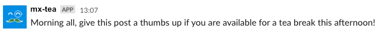

# mr-tea

Mr Tea is a [Slack Bot](https://api.slack.com/bot-users) who asks a simple question to a Slack channel...

> Source: Data Science Campus

Keen tea enthusiasts then give the post a thumbs up if they want to participate. We then use the list of people who gave a thumbs up to create groups for the tea break.

> Source: Data Science Campus

The scripts (`ask-question.py` and `post-group.py`) to do this are found here in `/scripts`. Visit [our blog post](https://datasciencecampus.github.io/creating-tea-breaks-on-slack/) to find out more information.
